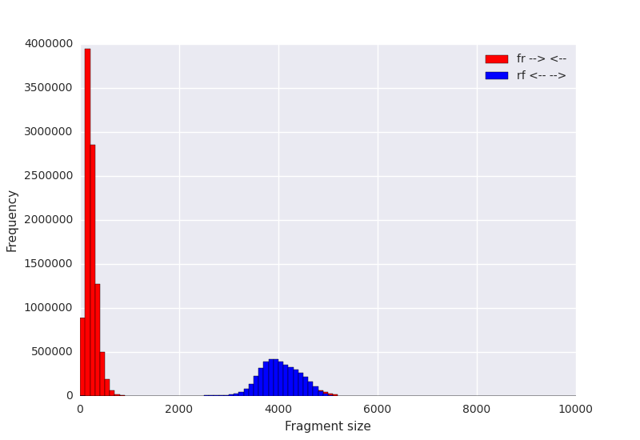
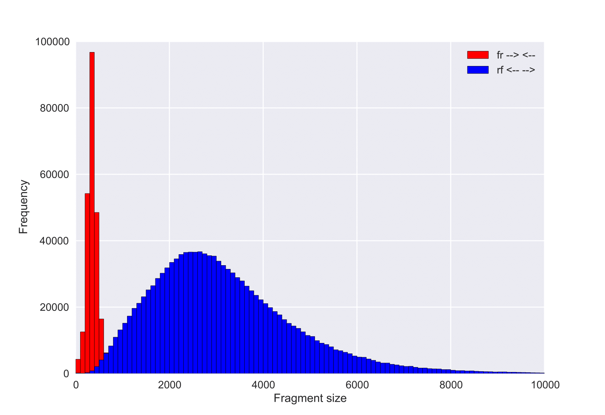

BESST
======

INSTALLATION
----------------
See docs/INSTALL.md.

Q&A
------------------

####  What parameters should I call BESST with?
BESST is designed to infer as much as possible from data. If this is your first time running BESST, it is highly reccomended to only run BESST as

```sh
runBESST -c /path/to/contigfile.fa -f /path/to/file1.bam /path/to/file2.bam ... -o /path/to/output --orientation {fr/rf}
```
For more details, see section "INPUT" further down. BESST will then infer ar much as possible from data and print everything to "/path/to/output/BESST_output/Statistics.txt". This file is useful for debugging.

####  What aligner should I use?
BESST requires only a sorted and indexed bamfile -- your favourite aligner can be used. However, we have had the best experience with BWA-mem using default parameters on most data used in our evaluations.

####  What aligner options are good/bad?
BESST only work with uniquely aligned reads for now (with the aim to extend it to consider probability distribution over multiple alignments). The uniqueness is detected in the sorted BAM file by looking at the flag. Therefore, it is NOT suitable to specify any parameter that makes the aligner output several (suboptimal) alignments of a read, and reporting the read as mapped to multiple locations. Bowtie's "-k <int>" (with int other than 1) is an example of a parameter that is not compatible with BESST. 

####  My mate pair libraries contains paired-end contamination, what should I do?

First off, always use an adaptertrimming tool. The trimming of adapters greatly improves alignemtns as both adapters, and chimeric parts withing reads (result of read sequence on different sides of the adapter), can greatly improve alignments and therefore scaffolding. We recommend any tool that can separate the paired reads types into MP, PE and unknown orientation based on identifying and <em>removing</em> the adapters (we have had good experience with the tool NxTrim)

###### Few adapters found -> read pairs have unknown orientation
In case the  you cannot single out any (or only a small fraction) of mate pairs based on adapter finding, just run BESST as default. BESST identifies MP distribution, PE contamination level and distribution by alignemtns on contigs. Do not specify -m and -s in this case as BESST has a relatively advanced inference of library characteristics (some of it from theory described in [GetDistr](http://biorxiv.org/content/biorxiv/early/2015/08/04/023929.full.pdf) ).

###### Significant amount of adapters found
From the MP libraries we have worked with, we usually see around 30% of each of the three categories MP,PE and unknown and should be relatively normal (see contamination levels investigation in supplemental data in [NxTrim](http://bioinformatics.oxfordjournals.org/content/early/2015/02/05/bioinformatics.btv057/suppl/DC1)). In case you can single out approximately this amount of MPs and PEs: The paired end contamination can still help BESST scaffolding by providing short range links complimentaty to long range MP links. The usage of these information sources simultaneosly as partly described in [BESST-v2](http://www.biorxiv.org/content/early/2015/08/28/025650.abstract) improves scaffolding over a stepwise approach that BESST and other stand-alone scaffolders takes in case of several separated libraries. We recommend to use the full <em>adapter trimmed</em> library i.e., all MP, PE and unknown reads together, with original orientations preserved, in case the distributions on the PE and MP are distinctively separated and the assembly contains enough small contigs where the short-range PE can help (say N75 < mean of MP as an approximation). See figure for an example of a clearly separated MP distribution. Notice that e.g. NxTrim will output all reads in fr orientation so the MPs will have to be reverse complemented back.



In case the MP distribution is wide and already has good short-range spanning coverge and good coverage in general, use only the links that were identified as MPs. Below is an example of such a distribution




The safe approach is of course always to try both. 


####  BESST does not scaffold anything, what is going on?

A lot of debugging can be done immediately in "< outputfolder >/BESST_output/Statistics.txt" file where outputfolder is specified with -o when running BESST. BESST outputs statistics of insert size distribution(s) (mate-pair and PE-contamination) as well as coverage statistics and how many read pair are used for scaffolding (for each library). Below is an example of the beginning of a file. Make sure library distribution, contamine distribution and rate looks ok, as well as coverage statistics. If this does not resolve issues or you are unsure about how to proceed, please mail **ksahlin@kth.se**.

```sh
PASS 1


Mean before filtering : 2471.05005763
Std_est  before filtering:  1621.22128565
Mean converged: 2454.01278202
Std_est converged:  1438.84572664
Contamine mean before filtering : 383.841809945
Contamine stddev before filtering:  541.063248334
Contamine mean converged: 371.132937665
Contamine std_est converged:  105.713828422

LIBRARY STATISTICS
Mean of library set to: 2454.01278202
Standard deviation of library set to:  1438.84572664
MP library PE contamination:
Contamine rate (rev comp oriented) estimated to:  0.228445050646
lib contamine mean (avg fragmentation size):  371.132937665
lib contamine stddev:  105.713828422
Number of contamined reads used for this calculation:  106857.0
-T (library insert size threshold) set to:  8209.39568857
-k set to (Scaffolding with contigs larger than):  8209.39568857
Number of links required to create an edge:  5
Read length set to:  100.38
Relative weight of dominating link set to (default=3):  3

Time elapsed for getting libmetrics, iteration 0: 41.3993628025

Parsing BAM file...
L50:  37 N50:  42455 Initial contig assembly length:  4588376
Nr of contigs that was singeled out due to length constraints 78
Time initializing BESST objects:  0.00225305557251
Nr of contigs/scaffolds included in scaffolding: 130
Total time elapsed for initializing Graph:  0.00791215896606
Reading bam file and creating scaffold graph...
ELAPSED reading file: 30.2451779842
NR OF FISHY READ LINKS:  0
Number of USEFUL READS (reads mapping to different contigs uniquly):  434284
Number of non unique reads (at least one read non-unique in read pair) that maps to different contigs (filtered out from scaffolding):  29267
Reads with too large insert size from "USEFUL READS" (filtered out):  325897
Number of duplicated reads indicated and removed:  4890
Mean coverage before filtering out extreme observations =  69.01403104
Std dev of coverage before filtering out extreme observations=  61.5185426061
Mean coverage after filtering =  51.1057077906
Std coverage after filtering =  17.4310506587
Length of longest contig in calc of coverage:  106467
Length of shortest contig in calc of coverage:  8270
```


NOTE:
----
#### Common pitfall: ####

If --orientation is not specified, BESST assumes that all libraries was aligned in fr orientation.
(In versions less than 1.2 BESST cannot parse rf orientations. Thus, BESST requires reads to be mapped in FR mode, i.e. --->  <---, matepairs thus need to be reverse complemented.)


#### Time and memory requirements: ####
Version 1.3 and later have implemented several major improvements in runtime and memory requirements. These fixes has the most effect on large fragmented assemblies with hundereds of thousands to millions of contigs.

#### Bam files and mapping  ####
BESST requires sorted and indexed bamfiles as input. Any read aligner + samtools can be used to obtain such files. Read pairs needs to be aligned in paired read mode. BESST provides a script (https://github.com/ksahlin/BESST/blob/master/scripts/reads_to_ctg_map.py) for obtaining sorted and indexed bamfiles with BWA-mem or BWA-sampe in one go. An example call for mapping with this script is

```sh
python reads_to_ctg_map.py /path/to/lib1_A.fq /path/to/lib1_A.fq /path/to/contigs.fasta --threads N
```
where N is an integer specifying how many threads BWA-mem should use. --nomem can be specified to the above call to use BWA-sampe as the paired read alignment pipeline.
 
INPUT:
------
Required arguments:

* -c < path to a contig file >

* -f < path to bamfiles >  (increasing order of insert size)

* -o < path to location for the output >

Highly recommended argument:

* --orientation < fr/rf one for each library >

EXAMPLE RUN:
-----------
For scaffolding with one PE and one MP library:
```sh
runBESST -c /path/to/contigfile.fa -f /path/to/file1.bam /path/to/file2.bam -o /path/to/output --orientation fr rf
```
If the mate pair library was reversed complemented before it was aligned, '--orientation fr fr' should be specified.

Optional arguments:
-------------------

The following arguments are computed internally / set by BESST. It is however good to specify mean and standard deviation if your assembly is very fragmented compared to the library insert size (not enough large contains to compute library statistics on).

#### Library parameters: ####

* -m < the means of the insert sizes of the library, one integer number for each library > (integer numbers)

* -s < standard deviation of the libraries, one integer number for each library> (integer numbers)
 
* -T < Thresholds that are some upper levels that you think not too many PE/MP will have a longer insert size than (in the end of the mode) > (integer numbers) 

* -r < Mean read length for each of the libraries > (integer number) 

* -z <ints> Coverage cutoff for repeat classification ( e.g. -z 100 says that contigs with coverages over 100 will be discarded from scaffolding). Integer numbers, one for each library) 

* -d Check for sequencing duplicates and count only one of them (when computing nr of links) if they are occurring.

#### Contig parameters: ####

* -k <ints> Minimum contig size to be seen as a "large contigs" (for statistical scoring only). One number for each library.

* --filter_contigs <int> Remove contigs smaller than this value from all scaffolding. These contigs are not even incuded in the outpus of BESST.


#### Algorithm parameters: ####

* --iter <int> Maximum number of iterations in BFS search for paths between scaffolds.

* --max_extensions <int> Maximum number of extensions performed between contig/scaffold ends.

* -e <int> The least amount of witness links that is needed to create a link edge in graph (one for each library)

* -y Extend scaffolds with smaller contigs (default on).

* --no_score Do not perform statistical scoring, only run path search between contigs.

* --score_cutoff <float> Only consider paths with score > score_cutoff (default 1.5)


#### Under construction / proven unstable ####

* -g < Haplotype detection function on or off > ( default = 0 (off) <0 or 1> )

* -a < Maximum length difference ratio for merging of haplotypic regions> (float nr)
 
* -b < Nr of standard deviations over mean/2 of coverage to allow for clasification of haplotype> (integer value) 

* -q < optinal flag > Parallellize work load of path finder module in case of multiple processors available using multiprocessing library for pyhton.


NOTE2:
-------

1. Definition of insert size: BESST assumes the following definitions: 
  * insert size = fragment length. 
  * For PE: 
```
   s                    t
   ------>      <-------
```
from s to t, that is, insertsize = readlen1 + gap + readlen2. So when mean and/or threshold is supplied, it should be mean and threshold of this distance.

2. Mapping reads: If you want to map a mate pair library, you will need to map them as paired end library i.e. forward-reverse mode. All read pair libraries should be in this order.

3. Order of scaffolding: It is crucial for the algorithm that you give the libraries in increasing order of the insert size.


